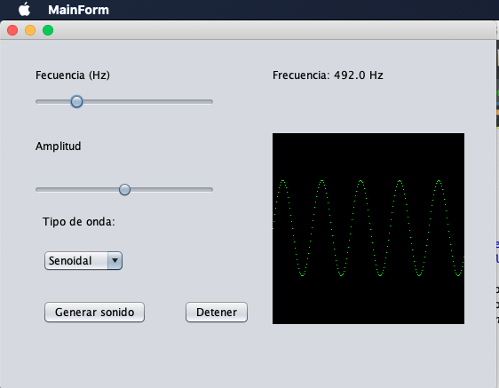
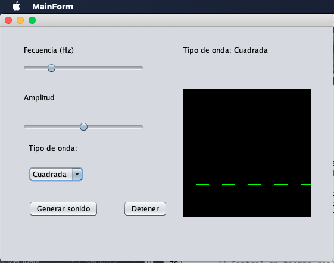

# Generador de Señales

Proyecto en Java para generar ondas **Senoidal**, **Cuadrada** y **Triangular** con sonido y visualización gráfica.

## Capturas de pantalla

### Onda Senoidal

### Onda Triangular

### Onda Cuadrada

## Uso

- Ajusta la frecuencia y amplitud con los sliders.
- Selecciona el tipo de onda con el combo.
- Presiona "Generar sonido" para reproducir la onda.
